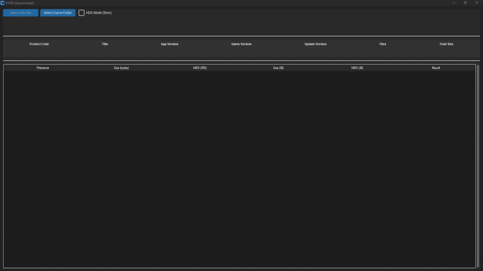

# PYIRD
PYIRD is a program for validating PlayStation 3 JB folder game backups using IRD files. It supports automatic fetching of IRD files from online database and provides detailed file-level integrity verification against the original decrypted game structure.

Installation
============
Windows
------------------------
Just download pyird_Windows.zip from [Releases](https://github.com/FlexBy420/pyird/releases/latest), extract the archive, and run the .exe.

Linux (WIP)
------------------------
Just download pyird_Linux.zip from [Releases](https://github.com/FlexBy420/pyird/releases/latest), extract the archive, and run the executable.

MacOS
------------------------
Download x64 or Arm build depending on your device from [Releases](https://github.com/FlexBy420/pyird/releases/latest), extract the archive, and run the executable.
MacOS might say the app couldn't be verified, go to settings, privacy and security, and allow anyway.

## Using PYIRD

Once the program is open, click **"Select Game Folder"** and choose a folder containing `PS3_GAME`.

PYIRD will then attempt to **auto-load a matching IRD** file. If one is not found locally, it will fetch it from the online [PS3 IRD database](https://flexby420.github.io/playstation_3_ird_database/). You can also manually load an IRD by clicking **"Select IRD File"**.

After loading the IRD, the program will **scan and validate the game folder**, comparing each file against the IRD. The results are displayed in the table, showing:

- **File Name**
- **Size**
- **MD5 checksums**
- **Validation result** (OK, Missing, or Invalid)  

Extra files in the folder will also be highlighted.

---

## File Locations
- **IRD Files:** Stored in an `ird` folder in the same directory as the program. Filename must include the product code at the beginning in the format `BLES01750` or `BLES-01750` for local check to work.
- **Logs:** Stored in `logs` folder in the same directory as the program.

## Preview
